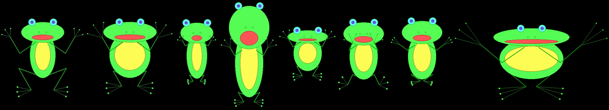
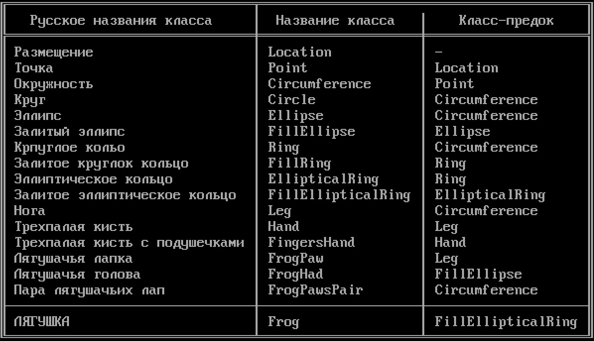
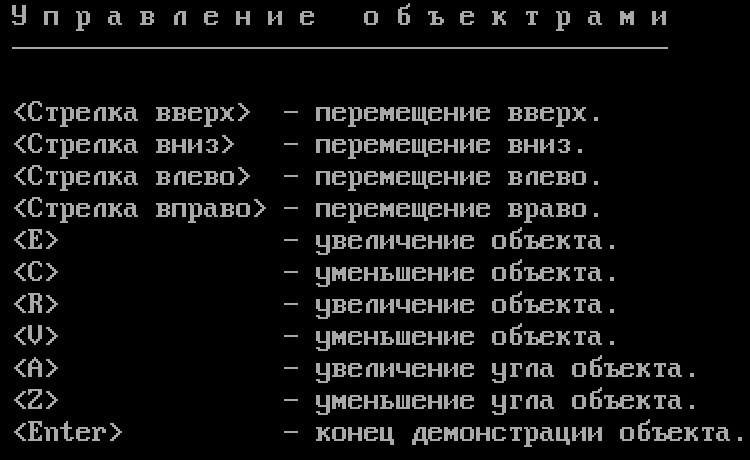

# Демонстративное приложение "Лягушка" (The Frog)


## Назначение программы
Освоение принципов объектно-ориентированного программирования (ООП) на С++.

## Средства разработки
- **Среда разработки**: Borland Turbo C++.
- **Язык программирования**: C++.
- **Операционная система**: MS-DOS.

## Запуск программы под Windows
Скачате релиз программы, распакуйте.

Поместите папку TheFrogDOSBox на диск **C:**.

Если у вас другой диск и другой путь, то придётся поменять пути в настройках программы в конце файла **TheFrogDOSBox/dosbox.conf**:
```
mount c "c:\TheFrogDOSBox"
c:
cd c:\TheFrog
RK
FROG.EXE
```

Запустите программу: **C:/TheFrogDOSBox/TheFrogDosBox.exe**.

Сделуйте инструкциям на экране.




Нажимайте клавишу \<Enter\> для продолжения.
Иногда необходимо нажимать клавишу \<Enter\> дважды, чтобы перейти к следующему действию.

## Статус проекта
Проект завершён.

## Контакты
Котова Екатерина Александровна,
e-mail: katekotova_86@mail.ru